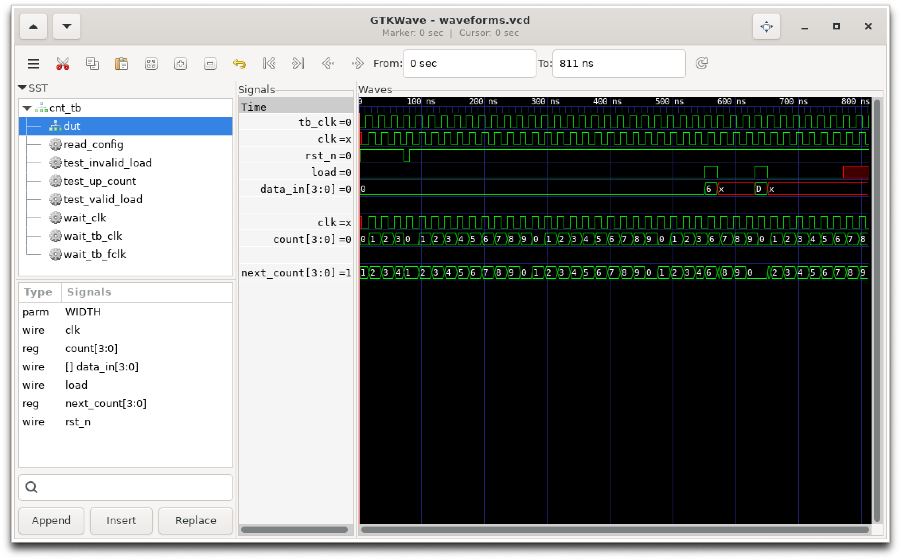
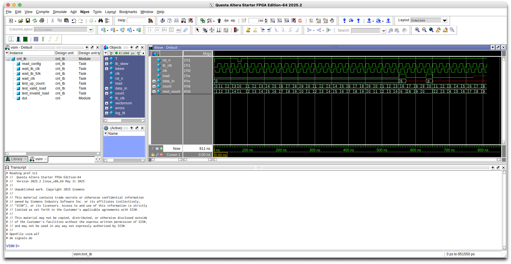
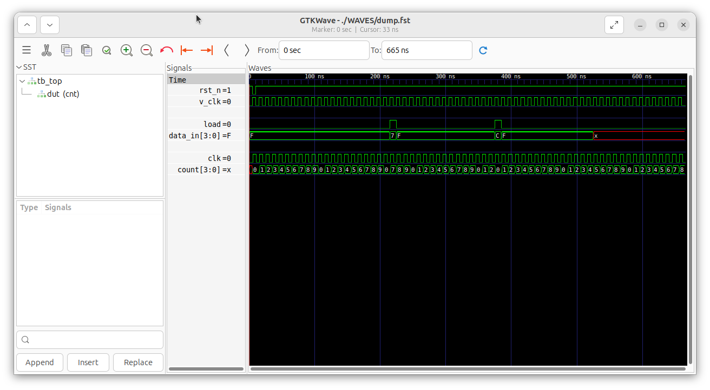

## RTL Design (SystemVerilog) | Verification (Questa & cocotb) | Synthesis (Quartus Lite)

### CAD tools eco-system

**1.** Set up `qtqs_tools` (see the following [link](https://github.com/claudiotalarico/qtqs_tools) for detailed instructions) <br>
**2.** `qtqs_tools` is a docker container that allows you to run Quartus Lite (version 25.1) and Quartus FSE.


### Modulo-10 Up-Counter with validated Load and async active low reset
```
mkdir -p /fpga-designs/01_counter
mkdir -p /fpga-designs/01_counter/RTL
mkdir -p /fpga-designs/01_counter/TB
cd /fpga-designs/01_counter
```

### SystemVerilog RTL Design
The design follows a two-block coding style: an `always_comb` block for the combinational logic and an `always_ff` block for the sequential logic.

- [`cnt.sv`](./01_counter/RTL/cnt.sv)

### Verification Using a Traditional SystemVerilog (SV) Testbench Approach

The input patterns in `cnt_tb.sv` are driven on the rising of a virtual clock `tb_clk` running at period `T`.<br>
The physical `clk` is phase‑shifted by `TB_SKEW` w.r.t. the virtual clock.<br>
The testbench is self-checking. Outputs are sampled `TSKEW` ns before the end of the clock cycle.

- [`cnt_tb.sv`](./01_counter/TB/cnt_tb.sv)
- [`config.txt`](./01_counter/config.txt)

The SV testbench parses an external configuration file (`config.txt`), allowing you to enable/disable specific regression tests and change key simulation parameters without modifying or recompiling the SV source.

To compile the design and the testbench run:
```
bash Comp.scr
```

To run the simulation and generate waveforms in both VCD and WLF formats use:
```
bash Sim.scr
```
Depending on which `vsim` line you leave uncommented, the simulation runs in one of four modes:
- **Interactive GUI** <br>
  The Questa GUI opens with the simulation paused at time 0.
    - Open the Wave window and drag the signals you want to monitor from the Objects pane.
    - Run the simulation from the console with `run -all` or use the toolbar.
- **Automatic with `waves.do`**<br>
  The GUI opens with predefined signals loaded and then closes automatically
    - VCD generation is handled inside the testbench.
- **Automatic with `waves_vcd.do`**<br>
   The GUI opens with predefined signals loaded and then closes automatically
    - VCD generation is driven explicitly by `waves_vcd.do` rather than the testbench
- **Batch (headless) with `waves_batch.do`**
    - no GUI is opened; the simulation runs to completion non-interactively.
    - VCD generation is handled inside the testbench.
      
Compilation and simulation can also be combined into a single script (`CompAndSim.scr`).

The scripts and the Questa `.do` files are:
- [`Comp.scr`](./01_counter/Comp.scr)
- [`Sim.scr`](./01_counter/Sim.scr)
- [`CompAndSim.scr`](./01_counter/CompAndSim.scr)
- [`waves.do`](./01_counter/waves.do)
- [`waves_vcd.do`](./01_counter/waves_vcd.do)
- [`waves_batch.do`](./01_counter/waves_batch.do)

## Analyzing the simulation waveforms

To analyze the simulation waveforms, open your generated waveform trace file (`.vcd` or `.fst` format) in GTKWave using the following command:
```
gtkwave waveforms.vcd
```

<p align="center">
       
</p>

By default, launching GTKWave with only a `.vcd` file opens an empty workspace, requiring you to manually navigate the Signal Search Tree (SST) to locate and add your desired signals.

To preserve your current waveform layout, including selected signals, zoom levels, and color configurations, you can save a GTKWave configuration file (`.gtkw`). To do this, execute the following sequence in the main menu:

<pre>File > Write Save File As > waveforms.gtkw </pre>

The next time you launch GTKWave, provide the configuration file `.gtkw` alongside the `.vcd` file to instantly restore your exact layout and avoid having to add the signals again:
  
```
gtkwave waveforms.vcd waveforms.gtkw
```

An alternative to GTKWave is to use Questa with its default generated Wave Log Format (`.wlf`) trace file:
```
vsim -gui vsim.wlf -do signals.do
```

The [`signals.do`](./01_counter/signals.do) file is a macro script used to automatically load, format, and arrange your desired signals in the waveform window.

<p align="center">
       
</p>

### Verification Using cocotb and Icarus Verilog (makefile-based workflow)
The input patterns (in `test_cnt.py`) are driven on the rising of a virtual clock `v_clk` running at `period_ns`. <br>
The virtual clock starts in the low state.<br>
The physical `clk` is phase‑shifted by `phase_ns` w.r.t. the virtual clock.<br>
To create a visible virtual clock we need to add a SV Testbench wrapper (`tb_top.sv`)


The verification environment incorporates an external configuration file (`config.yaml`), that allows to enable/disable specific regression tests and to change key simulation parameters without modifying the Python source code.

The cocoTB required files are:
- [`tb_top.sv`](./01_counter/RTL/tb_top.sv)
- [`test_cnt.py`](./01_counter/test_cnt.py)
- [`config.yaml`](./01_counter/config.yaml)
- [`Makefile`](./01_counter/Makefile)

To generate the test run:
```
cd /fpga-designs/01_counter	
make
```

<pre>
rm -f results.xml
"make" -f Makefile results.xml
make[1]: Entering directory '/home/talarico/google-drive/fpga-designs/01_counter'
/usr/bin/iverilog -o /home/talarico/google-drive/fpga-designs/01_counter/WAVES/sim.vvp -s tb_top -g2012 -f /home/talarico/google-drive/fpga-designs/01_counter/WAVES/cmds.f -s cocotb_iverilog_dump  /home/talarico/google-drive/fpga-designs/01_counter/RTL/cnt.sv /home/talarico/google-drive/fpga-designs/01_counter/RTL/tb_top.sv /home/talarico/google-drive/fpga-designs/01_counter/WAVES/cocotb_iverilog_dump.v
rm -f results.xml
COCOTB_TEST_MODULES=test_cnt COCOTB_TESTCASE= COCOTB_TEST_FILTER= COCOTB_TOPLEVEL=tb_top TOPLEVEL_LANG=verilog \
         /usr/bin/vvp -M /home/talarico/.venv/lib/python3.12/site-packages/cocotb/libs -m libcocotbvpi_icarus   /home/talarico/google-drive/fpga-designs/01_counter/WAVES/sim.vvp -fst  
     -.--ns INFO     gpi                                ..mbed/gpi_embed.cpp:93   in _embed_init_python              Using Python 3.12.4 interpreter at /home/talarico/.venv/bin/python3
     -.--ns INFO     gpi                                ../gpi/GpiCommon.cpp:79   in gpi_print_registered_impl       VPI registered
     0.00ns INFO     cocotb                             Running on Icarus Verilog version 12.0 (stable)
     0.00ns INFO     cocotb                             Seeding Python random module with 1781408505
     0.00ns INFO     cocotb                             Initialized cocotb v2.0.1 from /home/talarico/.venv/lib/python3.12/site-packages/cocotb
     0.00ns INFO     cocotb                             Running tests
FST info: dumpfile WAVES/dump.fst opened for output.
FST warning: /home/talarico/google-drive/fpga-designs/01_counte $dumpfile called after $dumpvars started,
                                                                using existing file (WAVES/dump.fst).
FST warning: ignoring signals in previously scanned scope tb_top.
FST warning: ignoring signals in previously scanned scope tb_top.dut.


     1.00ns INFO     cocotb.tb_top                      Starting Test: Time 1.0 ns


     1.00ns INFO     cocotb.tb_top                      -- Up Counter Verification (20 cycles)
    13.00ns INFO     cocotb.tb_top                      Iter. 00 | Got: 0000 | Expected: 0000
    23.00ns INFO     cocotb.tb_top                      Iter. 01 | Got: 0001 | Expected: 0001
    33.00ns INFO     cocotb.tb_top                      Iter. 02 | Got: 0010 | Expected: 0010
    43.00ns INFO     cocotb.tb_top                      Iter. 03 | Got: 0011 | Expected: 0011
    53.00ns INFO     cocotb.tb_top                      Iter. 04 | Got: 0100 | Expected: 0100
    63.00ns INFO     cocotb.tb_top                      Iter. 05 | Got: 0101 | Expected: 0101
    73.00ns INFO     cocotb.tb_top                      Iter. 06 | Got: 0110 | Expected: 0110
    83.00ns INFO     cocotb.tb_top                      Iter. 07 | Got: 0111 | Expected: 0111
    93.00ns INFO     cocotb.tb_top                      Iter. 08 | Got: 1000 | Expected: 1000
   103.00ns INFO     cocotb.tb_top                      Iter. 09 | Got: 1001 | Expected: 1001
   113.00ns INFO     cocotb.tb_top                      Iter. 10 | Got: 0000 | Expected: 0000
   123.00ns INFO     cocotb.tb_top                      Iter. 11 | Got: 0001 | Expected: 0001
   133.00ns INFO     cocotb.tb_top                      Iter. 12 | Got: 0010 | Expected: 0010
   143.00ns INFO     cocotb.tb_top                      Iter. 13 | Got: 0011 | Expected: 0011
   153.00ns INFO     cocotb.tb_top                      Iter. 14 | Got: 0100 | Expected: 0100
   163.00ns INFO     cocotb.tb_top                      Iter. 15 | Got: 0101 | Expected: 0101
   173.00ns INFO     cocotb.tb_top                      Iter. 16 | Got: 0110 | Expected: 0110
   183.00ns INFO     cocotb.tb_top                      Iter. 17 | Got: 0111 | Expected: 0111
   193.00ns INFO     cocotb.tb_top                      Iter. 18 | Got: 1000 | Expected: 1000
   203.00ns INFO     cocotb.tb_top                      Iter. 19 | Got: 1001 | Expected: 1001
   205.00ns INFO     cocotb.tb_top                      -- Up Counter Verification PASSED.


   205.00ns INFO     cocotb.tb_top                      -- Testing Valid Load (data_in = 7)
   223.00ns INFO     cocotb.tb_top                      Got: 0111 | Expected: 0111
   225.00ns INFO     cocotb.tb_top                      -- Valid Load Testing PASSED.


   365.00ns INFO     cocotb.tb_top                      -- Testing Invalid Load (data_in = 12)
   383.00ns INFO     cocotb.tb_top                      Got: 0000 | Expected: 0000
   385.00ns INFO     cocotb.tb_top                      -- Invalid Load Testing PASSED.


   525.00ns INFO     cocotb.tb_top                      Ending Test:: Time 525.0 ns

make[1]: Leaving directory '/home/talarico/google-drive/fpga-designs/01_counter'
  
</pre>

To diplay the simulation waveforms run:

```
make waves
```

or

```
make signals
```

<p align="center">
       
</p>


### Verification Using cocotb and Questa (Python runner workflow)

<!--
The cocoTB required files are:
- [`tb_top.sv`](./01_counter/RTL/tb_top.sv)
- [`test_counter.py`](./01_counter/test_cnt.py)
- [`config.yaml`](./01_counter/config.yaml)
-->
